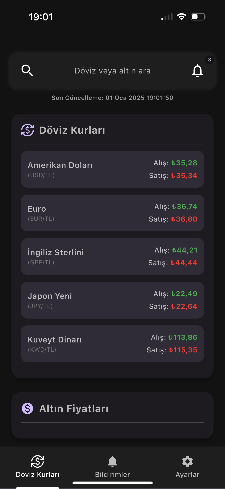
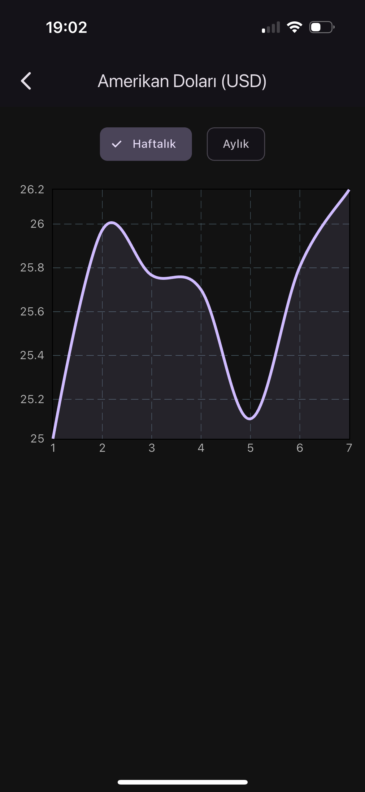
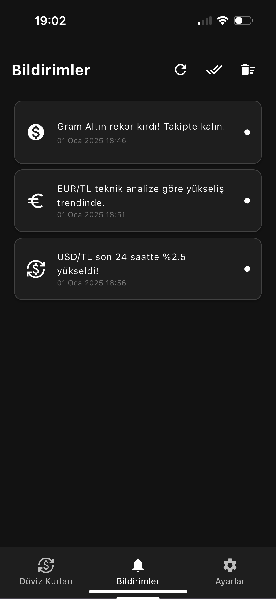
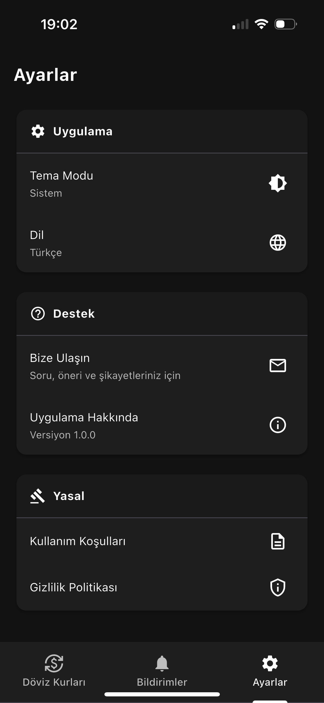

# 💱 Dovizle

<div align="center">
  
  <h3>Modern Döviz ve Altın Takip Uygulaması</h3>
</div>

## 📱 Uygulama Özellikleri

- 🔄 **Anlık Döviz Kurları**: TCMB'den güncel döviz kurlarını takip edin
- 💰 **Altın Fiyatları**: Gram ve ons altın fiyatlarını anlık izleyin
- 📊 **Detaylı Grafikler**: Haftalık ve aylık değişimleri görsel olarak inceleyin
- 🌙 **Geçmiş Veriler**: Son 10 günlük değişimleri takip edin
- 🌙 **Karanlık/Aydınlık Tema**: Göz yormayan tasarım
- 🌍 **Çoklu Dil Desteği**: Türkçe ve İngilizce dil seçenekleri
- 🔔 **Bildirimler**: Önemli kur değişikliklerinden haberdar olun
- 🔍 **Gelişmiş Arama**: Türkçe karakterli arama desteği

## 💰 Desteklenen Para Birimleri

- 🇺🇸 USD (Amerikan Doları)
- 🇪🇺 EUR (Euro)
- 🇬🇧 GBP (İngiliz Sterlini)
- 🇯🇵 JPY (Japon Yeni)
- 🇰🇼 KWD (Kuveyt Dinarı)
- 🇲🇽 MXN (Meksika Pezosu)
- 🇨🇦 CAD (Kanada Doları)
- 🇦🇺 AUD (Avustralya Doları)
- 🇨🇭 CHF (İsviçre Frangı)
- 🇨🇳 CNY (Çin Yuanı)
- 🇸🇪 SEK (İsveç Kronu)
- 🇳🇴 NOK (Norveç Kronu)
- 🇩🇰 DKK (Danimarka Kronu)
- 🇷🇺 RUB (Rus Rublesi)
- 🇮🇳 INR (Hindistan Rupisi)
- 🇸🇦 SAR (Suudi Arabistan Riyali)
- 💎 GOLD (Gram Altın)
- 💍 XAU (Ons Altın)

## 🛠️ Teknolojiler

- **Flutter**: UI geliştirme
- **Provider**: State yönetimi
- **fl_chart**: Grafik gösterimi
- **shared_preferences**: Yerel veri depolama
- **http**: API istekleri
- **intl**: Dil ve tarih formatlaması
- **xml**: TCMB verilerini işleme

## 📸 Ekran Görüntüleri

<div style="display: flex; justify-content: space-between;">
  
  
  
  
</div>

## 🚀 Kurulum

1. Flutter'ı yükleyin (https://flutter.dev/docs/get-started/install)
2. Projeyi klonlayın:
```bash
git clone https://github.com/ahmetyasary/Dovizle.git
```
3. Bağımlılıkları yükleyin:
```bash
cd Dovizle
flutter pub get
```
4. Uygulamayı çalıştırın:
```bash
flutter run
```

## 🤝 Desteklenen Platformlar

- ✅ iOS
- ✅ Android
- ✅ Web (yakında)
- ✅ macOS (yakında)
- ✅ Windows (yakında)
- ✅ Linux (yakında)

## 🤝 Katkıda Bulunma

1. Bu repository'yi fork edin
2. Yeni bir branch oluşturun (`git checkout -b feature/amazing`)
3. Değişikliklerinizi commit edin (`git commit -m 'Harika özellik eklendi'`)
4. Branch'inizi push edin (`git push origin feature/amazing`)
5. Bir Pull Request oluşturun

## 📄 Lisans

Bu proje MIT lisansı altında lisanslanmıştır. Daha fazla bilgi için `LICENSE` dosyasına bakın.

## 👨‍💻 Geliştirici

**Ahmet Yaşar**

[](https://github.com/ahmetyasary)

## ⭐️ Destek

Eğer bu proje size yardımcı olduysa, ⭐️ vermeyi unutmayın!
